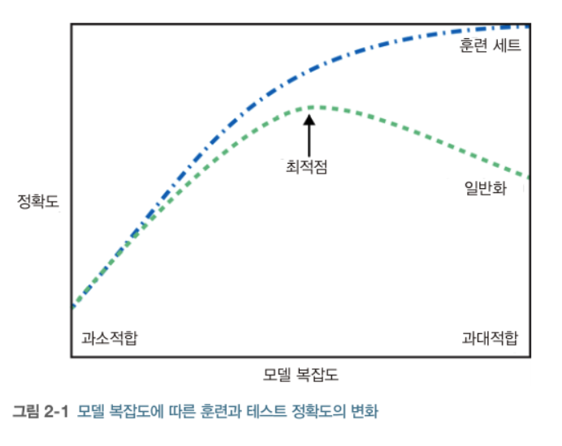

# 02 지도학습

## 2.1 분류와 회귀

지도학습

- 지도학습은 분류와 회귀로 나눌수 있다

- 분류(classification)
  - 미리 정의된, 가능성이 있는 클래스 레이블 중 하나를 예측하는 것
  - 이진 분류(binary classification): 두 개의 클래스로 분류
    - ex. 스팸 메일 분류
  - 자둥 분류(multiclass classification): 셋 이상의 클래스로 분류
    - ex. 붓꽃 분류기
  - 출력 값에 연속성이 없다
- 회귀(regression)
  - 연속적인 숫자, 부동소수점(실수)를 예측하는 것
  - ex. 교육 수준, 나이, 주거지를 바탕으로 연간 소득을 예측하는 것
  - 출력 값에 연속성이 있다

## 2.2 일반화, 과대적합, 과소적합

일반화(generalization)

- 모델이 **처음 보는 데이터에 대해 정확하게 예측**할 수 있으면, 훈련 세트에서 테스트 세트로 일반화가 되었다고 한다
- 훈련 세트에 맞는 복잡한 모델을 만드는 경우, 훈련 세트에"만" 정확한 모델이 될 수 있다

과대적합과 과소적합

- 과대적합(overfitting): 가진 정보를 모두 사용해서 너무 복잡한 모델을 만드는 것
- 과소적합(underfitting): 데이터의 다양성을 반영하지 않고 너무 간단한 모델을 만드는 것

우리가 찾는 모델은 "일반화 성능"이 최대가 되는 최적점에 있는 모델이다



### 2.2.1 모델 복잡도와 데이터셋 크기의 관계

모델의 복잡도는 훈련 데이터셋에 담긴 입력 데이터의 다양성과 관련이 깊다

다양한 데이터 포인터가 많을수록 과대적합 없이 더 복잡한 모델을 만들 수 있다.

## 2.3 지도 학습 알고리즘

### 2.3.1 예제에 사용할 데이터셋

데이터셋을 사용하기 위한 준비

```py
# mglearn 패키지를 설치
%pip install mglearn

# import packages
import mglearn
import matplotlib.pyplot as plt

```

forge 데이터셋

- 인위적으로 만든 이진 분류 데이터셋
- 특성 2개와 26개의 포인터를 갖는다

```py

X, y = mglearn.datasets.make_forge()
mglearn.discrete_scatter(X[:, 0], X[:, 1], y)
plt.legend(["클래스 0", "클래스 1"], loc=4)
plt.xlabel("첫 번째 특성")
plt.ylabel("두 번째 특성")

print("X.shape:", X.shape)
# X.shape: (26, 2)
```


wave 데이터셋

- 회귀 알고리즘
- 입력 특성 하나와 모델링할 타깃 변수(또는 응답)을 가진다
- 특성을 x축에 놓고 회귀의 타깃(출력)을 y축에 놓는다

```py
# wave 데이터셋
# 회귀 알고리즘에 사용

X, y = mglearn.datasets.make_wave(n_samples=40)
plt.plot(X, y, 'o')
plt.ylim(-3, 3)
plt.xlabel("Features")
plt.ylabel("Target")
```


scikit-learn의 cancer 데이터셋

- 각 종양은 양성과 악성으로 레이블되어 있고
- 조직 데이터를 기반으로 종양이 악성인지 예측할수 있도록 학습하는 것이 과제

```py
from sklearn.datasets import load_breast_cancer
cancer = load_breast_cancer()
print("cancer.keys():\n", cancer.keys())

# cancer.keys():
# dict_keys(['data', 'target', 'frame', 'target_names', 'DESCR', 'feature_names', 'filename', 'data_module'])
```

scikit-learn에 포함된 데이터셋은 Bunch 객체에 저장되어 있다.

- 딕셔너리와 비슷하지만 점표기법 사용가능
- bunch['key'] 대신 bunch.key 사용 가능

```py
# 569개의 데이터 포인트
# 30개의 특성

print("유방암 데이터의 형태", cancer.data.shape)

# Output
# 유방암 데이터의 형태 (569, 30)
```

```py
# 569 개 데이터 포인터 중
# 212 개는 악성이고
# 357 개는 양성이다

print("클래스별 샘플 개수:\n", {
  n: v for n, v in zip(cancer.target_names, np.bincount(cancer.target))
})

# Output
# 클래스별 샘플 개수:
#  {'malignant': 212, 'benign': 357}
```

```py
# feature_names 속성: 각 특성의 의미를 알 수 있다
print("특성 이름:\n", cancer.feature_names)

# 특성 이름:
#  ['mean radius' 'mean texture' 'mean perimeter' 'mean area'
#  'mean smoothness' 'mean compactness' 'mean concavity'
#  'mean concave points' 'mean symmetry' 'mean fractal dimension'
#  'radius error' 'texture error' 'perimeter error' 'area error'
#  'smoothness error' 'compactness error' 'concavity error'
#  'concave points error' 'symmetry error' 'fractal dimension error'
#  'worst radius' 'worst texture' 'worst perimeter' 'worst area'
#  'worst smoothness' 'worst compactness' 'worst concavity'
#  'worst concave points' 'worst symmetry' 'worst fractal dimension']
```

보스턴 주택 가격

- 회귀 분석용 실제 데이터셋
- 범죄율, 찰스강 인접도, 고속도로 접근성 등의 정보를 이용해 1970 년대 보스턴 주변의 주택 평균 가격을 예측
- 506 포인트와 13 특성이 있다

```py
# 보스턴 주택 가격 데이터셋
data_url = "http://lib.stat.cmu.edu/datasets/boston"
raw_df = pd.read_csv(data_url, sep="\s+", skiprows=22, header=None)
data = np.hstack([raw_df.values[::2, :], raw_df.values[1::2, :2]])
target = raw_df.values[1::2, 2]
print("데이터의 형태:", data.shape)

# Output
# 데이터의 형태: (506, 13)
```

확장된 데이터셋

- 13개의 입력특성 외에도 특성끼리 곱하여 (= 상호작용) 의도적으로 확장 하였다 = 특성 공학(feature engineering)
- 13 + 91 = 104

```py
X, y = mglearn.datasets.load_extended_boston()
print("X.shape:", X.shape)

# Output
# X.shape: (506, 104)
```

### 2.3.2 k-최근접 이웃

- K-NN; k-Nearest Neighbors
- 가장 간단한 머신러닝 알고리즘
- 훈련 데이터트를 그냥 저장하는 것이 모델을 만드는 과정의 전부이다
- 새로운 데이터 포인트에 예측을 할 때 알고리즘이 훈련 데이터셋에서 가장 가까운 포인트, 즉 '최근접 이웃'을 찾는다
