# 02 지도학습

## 2.1 분류와 회귀

지도학습

- 지도학습은 분류와 회귀로 나눌수 있다

- 분류(classification)
  - 미리 정의된, 가능성이 있는 클래스 레이블 중 하나를 예측하는 것
  - 이진 분류(binary classification): 두 개의 클래스로 분류
    - ex. 스팸 메일 분류
  - 자둥 분류(multiclass classification): 셋 이상의 클래스로 분류
    - ex. 붓꽃 분류기
  - 출력 값에 연속성이 없다
- 회귀(regression)
  - 연속적인 숫자, 부동소수점(실수)를 예측하는 것
  - ex. 교육 수준, 나이, 주거지를 바탕으로 연간 소득을 예측하는 것
  - 출력 값에 연속성이 있다

## 2.2 일반화, 과대적합, 과소적합

일반화(generalization)

- 모델이 **처음 보는 데이터에 대해 정확하게 예측**할 수 있으면, 훈련 세트에서 테스트 세트로 일반화가 되었다고 한다
- 훈련 세트에 맞는 복잡한 모델을 만드는 경우, 훈련 세트에"만" 정확한 모델이 될 수 있다

과대적합과 과소적합

- 과대적합(overfitting): 가진 정보를 모두 사용해서 너무 복잡한 모델을 만드는 것
- 과소적합(underfitting): 데이터의 다양성을 반영하지 않고 너무 간단한 모델을 만드는 것

우리가 찾는 모델은 "일반화 성능"이 최대가 되는 최적점에 있는 모델이다

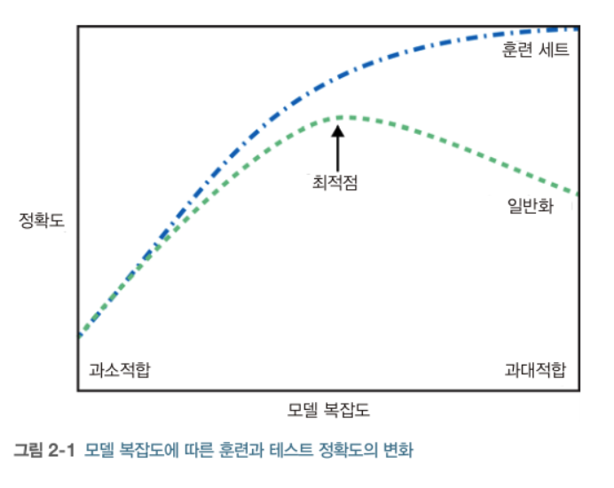

### 2.2.1 모델 복잡도와 데이터셋 크기의 관계

모델의 복잡도는 훈련 데이터셋에 담긴 입력 데이터의 다양성과 관련이 깊다

다양한 데이터 포인터가 많을수록 과대적합 없이 더 복잡한 모델을 만들 수 있다.

## 2.3 지도 학습 알고리즘

### 2.3.1 예제에 사용할 데이터셋

데이터셋을 사용하기 위한 준비

```py
# mglearn 패키지를 설치
%pip install mglearn

# import packages
import mglearn
import matplotlib.pyplot as plt

```

forge 데이터셋

- 인위적으로 만든 이진 분류 데이터셋
- 특성 2개와 26개의 포인터를 갖는다

```py

X, y = mglearn.datasets.make_forge()
mglearn.discrete_scatter(X[:, 0], X[:, 1], y)
plt.legend(["클래스 0", "클래스 1"], loc=4)
plt.xlabel("첫 번째 특성")
plt.ylabel("두 번째 특성")

print("X.shape:", X.shape)
# X.shape: (26, 2)
```

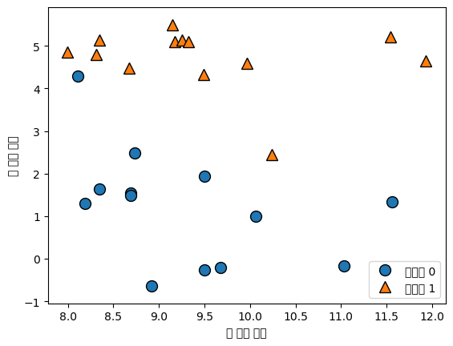

wave 데이터셋

- 회귀 알고리즘
- 입력 특성 하나와 모델링할 타깃 변수(또는 응답)을 가진다
- 특성을 x축에 놓고 회귀의 타깃(출력)을 y축에 놓는다

```py
# wave 데이터셋
# 회귀 알고리즘에 사용

X, y = mglearn.datasets.make_wave(n_samples=40)
plt.plot(X, y, 'o')
plt.ylim(-3, 3)
plt.xlabel("Features")
plt.ylabel("Target")
```

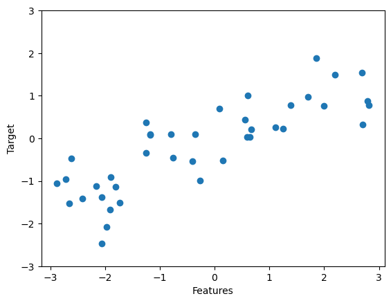

scikit-learn의 cancer 데이터셋

- 각 종양은 양성과 악성으로 레이블되어 있고
- 조직 데이터를 기반으로 종양이 악성인지 예측할수 있도록 학습하는 것이 과제

```py
from sklearn.datasets import load_breast_cancer
cancer = load_breast_cancer()
print("cancer.keys():\n", cancer.keys())

# cancer.keys():
# dict_keys(['data', 'target', 'frame', 'target_names', 'DESCR', 'feature_names', 'filename', 'data_module'])
```

scikit-learn에 포함된 데이터셋은 Bunch 객체에 저장되어 있다.

- 딕셔너리와 비슷하지만 점표기법 사용가능
- bunch['key'] 대신 bunch.key 사용 가능

```py
# 569개의 데이터 포인트
# 30개의 특성

print("유방암 데이터의 형태", cancer.data.shape)

# Output
# 유방암 데이터의 형태 (569, 30)
```

```py
# 569 개 데이터 포인터 중
# 212 개는 악성이고
# 357 개는 양성이다

print("클래스별 샘플 개수:\n", {
  n: v for n, v in zip(cancer.target_names, np.bincount(cancer.target))
})

# Output
# 클래스별 샘플 개수:
#  {'malignant': 212, 'benign': 357}
```

```py
# feature_names 속성: 각 특성의 의미를 알 수 있다
print("특성 이름:\n", cancer.feature_names)

# 특성 이름:
#  ['mean radius' 'mean texture' 'mean perimeter' 'mean area'
#  'mean smoothness' 'mean compactness' 'mean concavity'
#  'mean concave points' 'mean symmetry' 'mean fractal dimension'
#  'radius error' 'texture error' 'perimeter error' 'area error'
#  'smoothness error' 'compactness error' 'concavity error'
#  'concave points error' 'symmetry error' 'fractal dimension error'
#  'worst radius' 'worst texture' 'worst perimeter' 'worst area'
#  'worst smoothness' 'worst compactness' 'worst concavity'
#  'worst concave points' 'worst symmetry' 'worst fractal dimension']
```

보스턴 주택 가격

- 회귀 분석용 실제 데이터셋
- 범죄율, 찰스강 인접도, 고속도로 접근성 등의 정보를 이용해 1970 년대 보스턴 주변의 주택 평균 가격을 예측
- 506 포인트와 13 특성이 있다

```py
# 보스턴 주택 가격 데이터셋
data_url = "http://lib.stat.cmu.edu/datasets/boston"
raw_df = pd.read_csv(data_url, sep="\s+", skiprows=22, header=None)
data = np.hstack([raw_df.values[::2, :], raw_df.values[1::2, :2]])
target = raw_df.values[1::2, 2]
print("데이터의 형태:", data.shape)

# Output
# 데이터의 형태: (506, 13)
```

확장된 데이터셋

- 13개의 입력특성 외에도 특성끼리 곱하여 (= 상호작용) 의도적으로 확장 하였다 = 특성 공학(feature engineering)
- 13 + 91 = 104

```py
X, y = mglearn.datasets.load_extended_boston()
print("X.shape:", X.shape)

# Output
# X.shape: (506, 104)
```

### 2.3.2 k-최근접 이웃

- K-NN; k-Nearest Neighbors
- 가장 간단한 머신러닝 알고리즘
- 훈련 데이터트를 그냥 저장하는 것이 모델을 만드는 과정의 전부이다
- 새로운 데이터 포인트에 예측을 할 때 알고리즘이 훈련 데이터셋에서 가장 가까운 포인트, 즉 '최근접 이웃'을 찾는다

**k-최근접 이웃 분류**

- 가장 가까운 훈련 데이터 포인트를 하나를 최근접 이웃으로 찾아 예측에 사용

```py
# forge 데이터셋
mglearn.plots.plot_knn_classification(n_neighbors=1)
```

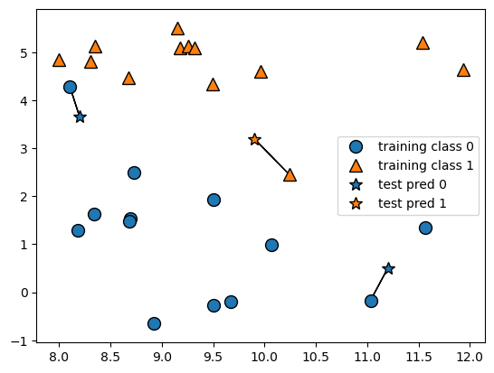

- 데이터 포인트 3개를 추가 (별)
- 추가한 데이터에 가장 가까운 훈련 데이터 포인터를 연결
- 1-KNN 알고리즘의 예측은 이 데이터의 레이블이 된다

하나가 아닌 임의의 k개를 선택할 수 있다

- 둘 이상의 이웃을 선택할 때는 레이블을 정하기 위한 투표를 한다
- 클래스 별로 속한 이웃이 몇 개인지 세알리고, 이웃이 많은 클래스를 레이블로 지정한다

```py
mglearn.plots.plot_knn_classification(n_neighbors=3)
```

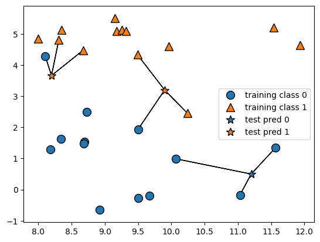

클래스가 많은 경우에도 이웃에 포함된 클래스의 갯수를 세알려 가장 많은 클래스를 예측값으로 사용한다

**scikit-learn을 사용하여 k-NN 알고리즘 적용**

```py
# 일반화 성능을 평가할 수 있도록 데이터를 훈련 세트와 테스트 세트로 나눔
from sklearn.model_selection import train_test_split
X, y = mglearn.datasets.make_forge()

X_train, X_test, y_train, y_test = train_test_split(X, y, random_state=0)

# KNeighborsClassifier 클래스를 임포트하고 객체를 만든다
# 이웃의 수 같은 매개변수를 지정한다
from sklearn.neighbors import KNeighborsClassifier
clf = KNeighborsClassifier(n_neighbors=3)

# 훈련 세트를 사용하여 분류 모델을 학습시킨다
# KNeighborsClassifier 학습: 예측할 때 이웃을 찾을 수 있도록 데이터를 저장
clf.fit(X_train, y_train)

# 테스트 데이터에 대해 predict 메서드를 호출하여 예측한다
# 각 데이터 포인트에 대해 훈련 세트에서 가장 가까운 이웃을 계산한 다음 가장 많은 데이터를 찾는다
print("테스트 세트 예측:", clf.predict(X_test))
# Output
# 테스트 세트 예측: [1 0 1 0 1 0 0]

# 일반화 평가
# score 메서드에 테스트 데이터와 테스트 레이블을 넣어 호출한다
print("테스트 세트 정확도: {:.2f}".format(clf.score(X_test, y_test)))
# Output
# 테스트 세트 정확도: 0.86
# 86% 정확도; 모델이 테스트 데이터셋에 있는 샘플 중 86%를 정확히 예측하였다
```

**KNeighborsClassifier 분석**

- 2차원 데이터셋이므로 가능한 모든 테스트 포인트의 예측을 xy 평면에 그려볼 수 있다
- 각 데이터 포인트에 속한 클래스에 따라 평면을 칠하면 지정한 영역으로 나뉘는 결정 경계 (decision boundary)를 볼 수 있다.

```py
# Decision boundary
fig, axes = plt.subplots(1, 3, figsize=(10, 3))

for n_neighbors, ax in zip([1, 3, 9], axes):
  # fit: sef 오브젝트를 리턴
  # 객체 생성과 fot 메서드를 한줄에 쓸 수 있다
  clf = KNeighborsClassifier(n_neighbors=n_neighbors).fit(X, y)
  # 결정 경계
  mglearn.plots.plot_2d_separator(clf, X, fill=True, eps=0.5, ax=ax, alpha=.4)
  # 분산도
  mglearn.discrete_scatter(X[:, 0],X[:,1], y,ax=ax)
  # 타이틀 & 레전드
  ax.set_title("{} Neighbor".format(n_neighbors))
  ax.set_xlabel("Feature 0")
  ax.set_ylabel("Feature 1")

axes[0].legend(loc=3)
```

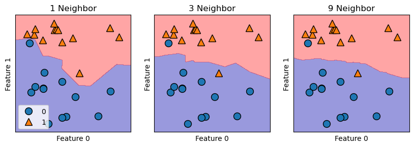

- 이웃 1: 훈련 데이터에 가깝다 -> 복잡도가 올라가고
- 이웃 9: 경계가 부드러워 진다 -> 복잡도가 낮아진다

**유방암 데이터셋을 사용하여 모델의 복잡도와 일반화 사이의 관계를 입증**

```py
# 1. 테스트 세트와 훈련 세트를 나누고
# 2. 이웃수를 달리하여 훈련 세트와 테스트 세트의 성능을 평가

from sklearn.model_selection import train_test_split
from sklearn.datasets import load_breast_cancer
from sklearn.neighbors import KNeighborsClassifier
import matplotlib.pyplot as plt

cancer = load_breast_cancer()
X_train, X_test, y_train, y_test = train_test_split(cancer.data, cancer.target, stratify=cancer.target, random_state=66)
# stratify: 기존 데이터를 나누는 것에 그치는 게 아니라, 클래스 분포 비율까지 맞춰준다
# Stratified sampling: 훈련데이터를 나눌 때 무작위로 샘플링을 하되, 클래스 비율이 train, test 세트에도 동일하게 유지되는 것을 보장한다
# https://hyjykelly.tistory.com/44

training_accurary = []
test_accuracy = []

# 1 에서 10 까지 n_neighbors 를 적용
neighbors_settings = range(1, 10)

for n_neighbors in neighbors_settings:
  # 모델 생성
  clf = KNeighborsClassifier(n_neighbors=n_neighbors)
  clf.fit(X_train, y_train)
  # 훈련 세트 정확도 저장
  training_accurary.append(clf.score(X_train, y_train))
  # 일반화 정확도 저장
  test_accuracy.append(clf.score(X_test, y_test))

plt.plot(neighbors_settings, training_accurary, label="training accurary")
plt.plot(neighbors_settings, test_accuracy, label="test accuracy")
plt.ylabel("Accurary")
plt.ylabel("n_neighbors")
plt.legend()
```

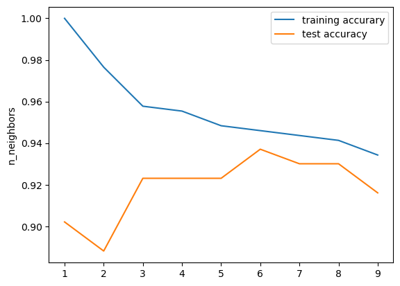

- n_neighbors 수에 따른 훈련 세트와 테스트 세트 정확도
- 과대적합: 이웃의 수가 적을 수록 모델이 복잡해지고
- 과소적합: 이웃이 많을 수록 모델이 단순해진다
- 정확도가 가장 좋을 때: n_neighbors = 6

**k-최근접 이웃 회귀**

KNN 알고리즘은 회귀 분석에서도 사용 할 수 있다

1-KNN

- 가장 가까운 타깃이 예측 값

```py
mglearn.plots.plot_knn_regression(n_neighbors=1)
```

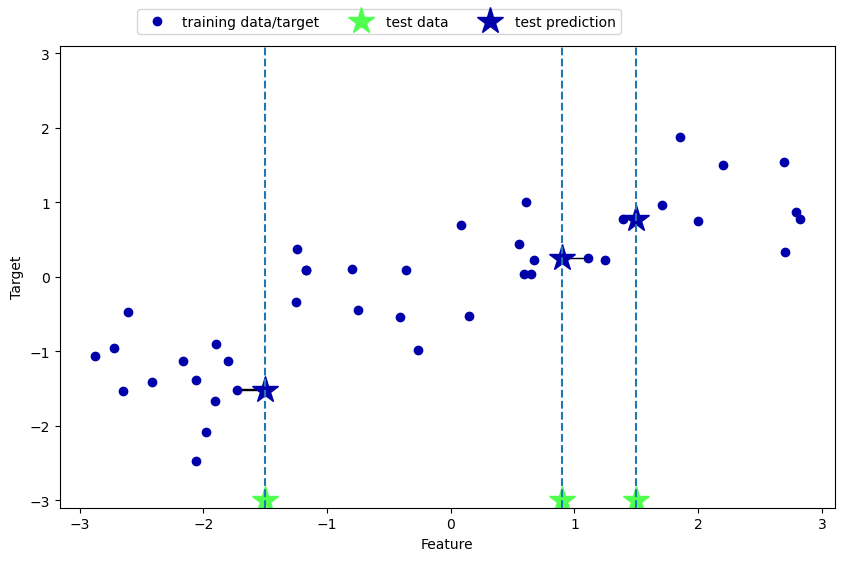

3-KNN

- 여러 개의 최근접 이웃을 사용할 때 이웃 간의 평균이 예측 된다

```py
mglearn.plots.plot_knn_regression(n_neighbors=3)
```

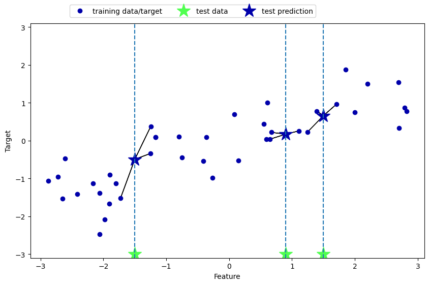

KNeighborsRegressor

- scikit-learn 에 구현된 회귀를 위한 KNN 알고리즘

```py
from sklearn.neighbors import KNeighborsRegressor

X, y = mglearn.datasets.make_wave(n_samples=40)

# wave 데이터셋을 훈련 세트와 테스트 세트로 나눈다
X_train, X_test, y_train, y_test = train_test_split(X, y, random_state=0)

# 이웃의 수를 3으로 하여 모델의 객체를 만든다
reg = KNeighborsRegressor(n_neighbors=3)

# 훈련 데이터와 타깃을 사용하여 모델을 학습시킨다
reg.fit(X_train, y_train)

# 테스트 세트에 대해 예측을 한다
print("테스트 세트 예측:\n", reg.predict(X_test))

# Output
# 테스트 세트 예측:
# [-0.05396539  0.35686046  1.13671923 -1.89415682 -1.13881398 -1.63113382  0.35686046  0.91241374 -0.44680446 -1.13881398]

# score 메서드를 사용하여 모델을 평가할 수 있다
# 회귀 일떄 R^2 를 반환 (0 ~ 1)
# 1: 예측이 완벽한 경우
# 0: 훈련 세트의 출력값인 y_train의 평균으로만 예측하는 모델
# 음수: 예측과 타깃이 상반되는 경향을 가지는 경우

print("테스트 세트 R^2: {:.2f}".format(reg.score(X_test, y_test)))

# Output
# 테스트 세트 R^2: 0.83
```

**KNeighborsRegressor 분석**

1차원 데이터셋에 대해 가능한 모든 특성 값을 만들어 예측해볼 수 있다

```py
# KNeighborsRegressor 분석

fig, axes = plt.subplots(1, 3, figsize=(15, 4))
# -3 과 3 사이에 1000 개의 데이터 포인트를 만든다

line = np.linspace(-3, 3, 1000).reshape(-1,1)
# numpy.reshape
# Gives a new shape to an array without changing its data.

for n_neighbors, ax in zip([1,3,9], axes):
  # 1, 3, 9 이웃을 사용한 예측을 한다
  reg = KNeighborsRegressor(n_neighbors=n_neighbors)
  reg.fit(X_train, y_train)
  ax.plot(line, reg.predict(line))
  ax.plot(X_train, y_train, '^', c=mglearn.cm2(0), markersize=8)
  ax.plot(X_test, y_test, 'v', c=mglearn.cm2(1), markersize=8)

  ax.set_title(
    "{} neighbors Training Score: {:.2f} Test Score: {:.2f}".format(n_neighbors, reg.score(X_train, y_train), reg.score(X_test, y_test))
  )

  ax.set_xlabel("Features")
  ax.set_ylabel("Targets")

axes[0].legend(["Model Predict", "Training Data/Target", "Test Data/Target"], loc="best")
```

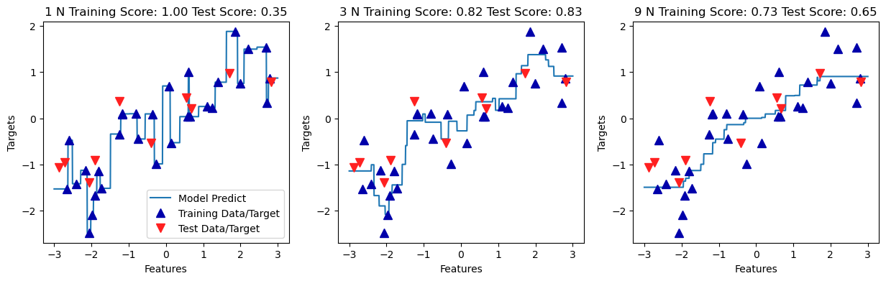

- N:1: 훈련 세트의 각 데이터 포인트가 예측에 주는 영향이 커서 예측값이 훈련 데이터 포인트를 모두 지나간다 (불안전한 예측)
- N:9: 훈련 데이터에는 잘 안 맞을 수 있지만 더 안정적 예측을 얻게 된다

**장단점과 매개변수**

KNeighbors 분류기의 매개변수

- 데이터 포인트 사이의 거리를 재는 방법
  - 기본적으로 유클리디안 거리 방식을 사용
  - 이웃 간의 거리를 계산할 때 특성마다 값의 범위가 다르면 범위가 작은 특정에 크게 영향을 받는다. 따라서 k-NN 알고리즘을 사용할 때는 같은 스케일을 갖도록 정규화하는 것이 일반 적이다
- 이웃의 수: 3~5개 정도로 적을 대 잘 작동하지만, 조정이 필요하다

KNN 장점

- 이해하기 쉽고, 많이 조정하지 않아도 자주 좋은 성능을 발휘한다
- 복잡한 알고리즘을 적용해보기 전에 시도해볼만 하다

KNN 단점

- 빠르게 만들 수 있지만, 훈련 세트가 애무 크면 (특성 수, 샘플 수) 예측이 느려진다
- 데이터 전처리 과정이 중요하다
- 수백 개 이상의 많은 특성을 가진 데이터셋에는 잘 동작하지않으며
- 특성 값이 대부분 0인 데이터셋과는 잘 작동하지 않는다

결론: KNN 알고리즘은 이해하기 쉽지만 예측이 느리고 많은 특성을 처리하는 능력이 부족해 현업에서는 잘 쓰지 않는다

### 2.3.3 선형 모델

선형 모델은 입력 특성에 대한 "선형 함수"를 만들어 예측을 수행한다

**회귀의 선형 모델**

선형 모델을 위한 일반화된 예측 함수

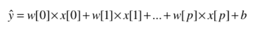

- x[0] ~ x[p]
  - 하나의 데이터 포인트에 대한 특성
  - 특성의 개수: p + 1
- w, b: 모델이 학습할 파라미터 (모델 파라미터, 계수)
  - 반대로, 사람이 직접 설정해 주어야하는 파라미터: 하이퍼파리미터, 매개변수
- y: 모델이 만들어낸 예측값

특성이 하나인 경우

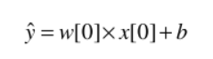

- w[0]: 기울기
- b: 절펀
- 특성이 많아지만 w는 각 특성에 해당하는 기울기를 모두 가진다
- 예측값: 입력 특성에 w의 각 가중치를 곱해서 더한 가중치 합

wave 데이터셋으로 파라미터 w[0]와 b를 직선처럼 되도록 학습

```py
mglearn.plots.plot_linear_regression_wave()
```

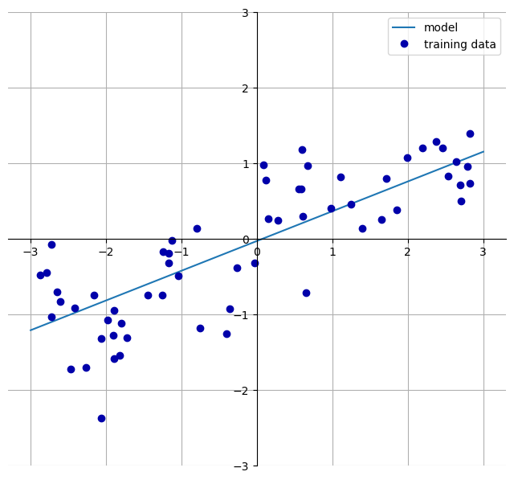

회귀를 위한 선형 모델은 특성이 1개이면 직선, 2개이면 평면, 3개이면 초평면이되는 회귀 모델의 특징을 가지고 있다.

훈련 데이터보다 특성이 더 많은 경우엔 타깃 y도 완벽하게 (훈련 세트에 대해서) 선형 함수로 모델할 수 있다

회귀를 위한 선형 모델은 훈련 데이터로부터 모델 파라미터 w와 b를 학습하는 방법과 모델의 복잡도를 제어하는 방법이서 차이가 난다.

**선형 회귀(최소 제곱법)**

선형 회귀(linear regression) 또는 최소 제곱법(OLS, ordinary least squares)

- 예측과 훈련 세트에 있는 타깃 y 사이의 평균제곱오차를 최소화하는 파라미터 w와 b를 찾는다
- 평균제곱오차: 예측값과 타깃 값의 차이를 제곱하여 더한 후 샘플의 개수로 나눈 것
  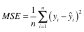
- 매개변수가 없는 것이 장점이지만, 모델의 복잡도를 제어할 방법도 없다

선형 모델을 만드는 코드

```py
from sklearn.linear_model import LinearRegression
X, y = mglearn.datasets.make_wave(n_samples=60)
X_train, X_test, y_train, y_test = train_test_split(X, y, random_state=42)

lr = LinearRegression().fit(X_train, y_train)

# w (weight/coefficient) = lr.coef_
# b (offset/intercept) = lr.intercept_

print("lr.coef_", lr.coef_)
print("lr.intercept_", lr.intercept_)

# output
# lr.coef_ [0.39390555]
# lr.intercept_ -0.031804343026759746
```

- 학습된 선형 회귀 모델은 w 파라미터와 b 파라미터를 속성에 저장하고 있다
- w
  - 가중치(weight), 계수(coefficient)
  - `lr.coef_`
  - 각 입력 특성에 하나씩 대응되는 NumPy 배열
- b:
  - 편향(offset), 절편(intercept)
  - `lr.intercept_`
  - 항상 실수 값 하나

훈련 세트와 테스트 세트의 성능 확인

```py
# 훈련 세트와 테스트 세트의 성능 확인
print("훈련 세트 점수: {:.2f}".format(lr.score(X_train, y_train)))
print("테스트 세트 점수: {:.2f}".format(lr.score(X_test, y_test)))

# Output
# 훈련 세트 점수: 0.67
# 테스트 세트 점수: 0.66
```

R^2 = 0.66

- 낮은 점수 & 훈련 세트와 테스트 세트의 점수가 비슷
- 과소적합 상태를 의심할 수 있다

과대적합

- 1차원 데이터셋: 모델이 단순하므로 과대적합을 고려할 필요 X
- 고차원 데이터셋: 선형 모델의 성능이 매우 높아져 과대적합될 가능성이 높다

보스턴 주택가격 데이터셋 (샘플 506, 특성 104) + LinearRegression 모델

```py
# 데이터셋 읽기
X, y = mglearn.datasets.load_extended_boston()

# 훈련/테스트 세트 스플릿
X_train, X_test, y_train, y_test = train_test_split(X, y, random_state=0)

# 선형 모델 학습
lr = LinearRegression().fit(X_train, y_train)

# 점수 비교 (R^2)
print("훈련 세트 점수: {:.2f}".format(lr.score(X_train, y_train)))
print("테스트 세트 점수: {:.2f}".format(lr.score(X_test, y_test)))

# Output
# 훈련 세트 점수: 0.95
# 테스트 세트 점수: 0.61
```

R^2

- 훈련 세트에는 예측이 매우 정확한 반면 테스트 세트에서는 예측이 매우 낮다
- 과대적합을 의심할 수 있으며, 복잡도를 제어할 수 있는 모델을 사용해야 한다

**리지 회귀**

가중치(w)의 절대값을 가능한 한 작게 만든다

- = 모든 특성이 출력에 주는 영향을 최소한으로 만든다
- = 규제(Regularization)
  - 과대적합이 되지 않도록 모델을 강제로 제한한다
  - L2 규제
    - 리지 회귀에 사용하는 규제 방식
    - 수학적으로 리지는 계수의 L2 노름(norm)의 제곱을 패널티로 적용한다

보스턴 주택가격 데이터셋 + 리지 회귀(`linear_model.Ridge`)

```py
# 보스턴 주택가격 데이터셋 + 리지 회귀(`linear_model.Ridge`)
from sklearn.linear_model import Ridge

# 리지 모델 학습
ridge = Ridge().fit(X_train, y_train)

# R^2 점수 조회
print("훈련 세트 점수: {:.2f}".format(ridge.score(X_train, y_train)))
print("테스트 세트 점수: {:.2f}".format(ridge.score(X_test, y_test)))

# Output
# 훈련 세트 점수: 0.89
# 테스트 세트 점수: 0.75
```

훈련 세트 점수는 선형 회귀 보다 낮아 졌지만. 테스트 세트 점수는 더 높아 졌다.

- Ridge 모델이 덜 자유로운 모델이기 때문에 과대적합이 적어진다.
- 모델의 복잡도가 낮아지면서, 훈련 세트에서 성능은 나빠지지만, 더 일반화된 모델이 된다

alpha 매개변수

- 훈련 세트의 성능 대비 모델을 얼마나 단순화할지 지정할 수 있다
- 기본값: 1.0
- alpha 값을 높이면 계수를 0에 더 가깝게 만들어 훈련 세트의 성능은 나빠지지만 일반화에는 도움을 줄 수 있다
- alpha 값을 줄여 테스트 세트에 대한 성능을 높일 수 있다

```py
# alpha 값이 10일 때 성능

ridge10 = Ridge(alpha=10).fit(X_train, y_train)
print("훈련 세트 점수: {:.2f}".format(ridge10.score(X_train, y_train)))
print("테스트 세트 점수: {:.2f}".format(ridge10.score(X_test, y_test)))

# Output
# 훈련 세트 점수: 0.79
# 테스트 세트 점수: 0.64

```

```py
# alpha 값이 0.1일 때 성능

ridge01 = Ridge(alpha=0.1).fit(X_train, y_train)
print("훈련 세트 점수: {:.2f}".format(ridge01.score(X_train, y_train)))
print("테스트 세트 점수: {:.2f}".format(ridge01.score(X_test, y_test)))

# Output
# 훈련 세트 점수: 0.93
# 테스트 세트 점수: 0.77
```

alpha 값에 따른 모델의 coef\_ 절대값

- alpha 값을 높이면 제약이 커진다, 즉 w(coef\_)의 절대값 크기는 작아진다

```py
# a 크기에 따른 w(coef_) 값

plt.plot(ridge10.coef_, '^', label="Ridge a=10")
plt.plot(ridge.coef_, 's', label="Ridge a=1")
plt.plot(ridge01.coef_, 'v', label="Ridge a=0.1")
plt.plot(lr.coef_, 'o', label="LinearRegression")

plt.xlabel("Coefficient List")
plt.ylabel("Coefficient Size")

xlims = plt.xlim()
plt.hlines(0, xlims[0], xlims[1])
plt.xlim(xlims)
plt.ylim(-25, 25)
plt.legend()
```

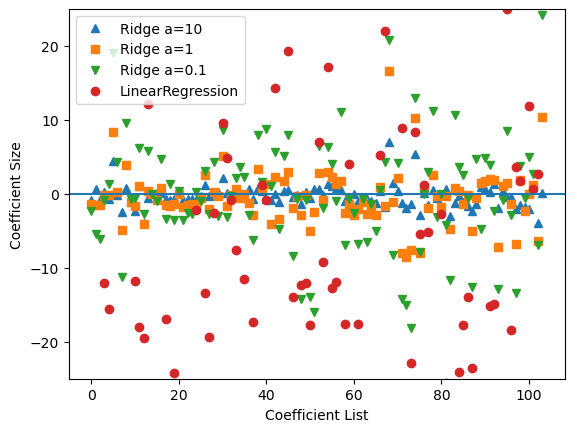

- x축: coef\_ 원소를 위치대로 나열
  - x=index: index+1 번째 특성에 연관된 계수
- y축: 각 계수의 수치
  - alpha가 작아질 수록, 계수는 Ridge 모델의 계수는 커진다
  - alpha가 적용되지 않은 선형 회귀의 계수 값이 가장 크다

alpha 값을 고정하고 훈련 데이터의 크기를 변화시켜 성능을 비교

- 학습 곡선(learning curve)
  - 데이터셋의 크기에 따른 모델의 성능 변화를 나타낸 그래프

```py
# 샘플 수에 따른 성능 비교
mglearn.plots.plot_ridge_n_samples()
```

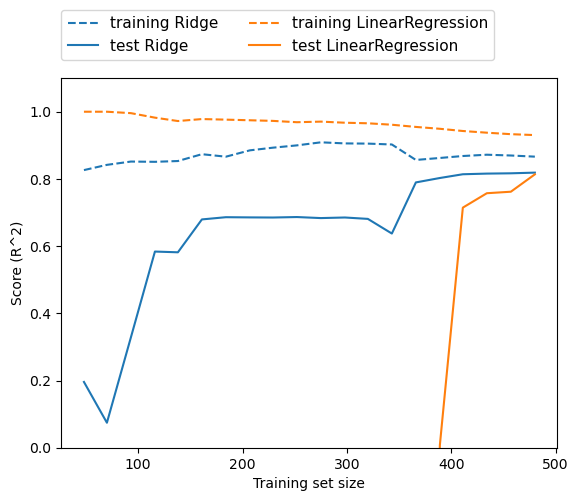

- 훈련 점수 > 테스트 점수
- 선형 훈련 점수 > 리지 훈련 점수 (규제 적용)
- 선형 테스트 점수 < 리지 테스트 점수 (특히, 샘플이 낮을 때)
  - 샘플 400 이하: 선형 모델 학습 X
- 샘플이 커질 수록 점수가 높다
- 데이터가 충분할 경우 규제 항이 덜 중요해져서 리지 회귀와 선형 회귀 성능이 같이진다.
- 선형 회귀의 훈련 점수가 낮아진다. 데이터가 많아 질 수록 모델이 데이터를 기억하거나 과대적합하기 어려워진다.

**라소**
p. 83

<!-- ### 2.3.4 나이브 베이즈 분류기

### 2.3.5 결정 트리

### 2.3.6 결정 트리의 앙상블

### 2.3.7 커널 서포트 백터 머신

### 2.3.8 신경망 (딥러닝) -->
